# Architecture (technical)

## Stack

- **Frontend:** React 18, TypeScript, Vite 5.
- **Inference:** [Nebius](https://docs.nebius.com/) Token Factory **OpenAI-compatible** HTTP API:
  - `POST {base}/chat/completions` — LLM reranking, agentic decomposition/synthesis, metadata extraction.
  - `POST {base}/embeddings` — query vectors (and offline corpus vectors in `embed-sample` script).
- **Live data:** data.gv.at **Hub-Search** API, reached in dev via **Vite proxy** (CORS); production calls the `https://` URL directly (Hub-Search sends `Access-Control-Allow-Origin: *`).
- **PDF extraction:** `pdfjs-dist` — runs entirely in the browser, no server upload.

## High-level diagram

```mermaid
flowchart TB
  subgraph live [Live Hub-Search mode]
    U1[User query]
    P[Vite proxy /api/hub/search]
    HS[data.gv.at Hub-Search /search]
    CHAT1[Nebius chat completions]
    U1 --> P --> HS
    HS --> CHAT1
  end

  subgraph sample [Sample catalog lab]
    U2[User query]
    BM25[BM25 ranker in browser]
    IDX[public/sample-embeddings.json]
    EMB[Nebius embeddings API]
    COS[Cosine top-k]
    RRF[RRF fusion]
    CHAT2[Nebius chat completions]
    LIVE2[Hub-Search parallel fetch]
    COMBINED[Combined pool LLM rerank]
    U2 --> BM25
    U2 --> EMB --> COS
    BM25 --> RRF
    COS --> RRF
    RRF --> CHAT2
    IDX --> COS
    RRF --> COMBINED
    LIVE2 --> COMBINED
  end

  subgraph agentic [Agentic Search mode]
    U3[User description]
    DECOMP[LLM decompose → sub-queries]
    MULTI[Parallel Hub-Search per sub-query]
    SYNTH[LLM synthesize + rank candidates]
    U3 --> DECOMP --> MULTI --> SYNTH
  end

  subgraph meta [Metadata Generator mode]
    U4[PDF upload]
    PDFJS[pdfjs-dist text extraction]
    METALLM[LLM → DCAT-AP.at fields]
    U4 --> PDFJS --> METALLM
  end
```



## Source layout (relevant parts)

| Path | Role |
|------|------|
| `src/App.tsx` | Mode switch (live / sample / agentic / metadata), orchestrates searches and reranking |
| `src/lib/ckan.ts` | Hub-Search client (`/api/hub/search/search` in dev; full HTTPS in prod); maps `HubHit` → `CKANDataset` |
| `src/lib/nebius.ts` | Shared Nebius config, `fetch` wrappers for chat + embeddings; uses `/api/nebius` Vite proxy in dev |
| `src/lib/reranker.ts` | Builds LLM prompt; parses JSON array of `{ index, score, note }` |
| `src/lib/agenticSearch.ts` | `decomposeQuery` (LLM → sub-queries + summary); `synthesizeProposals` (LLM scores all candidates with rationale) |
| `src/lib/datasetText.ts` | Concatenates title, notes, org, tags for indexing |
| `src/lib/lexical.ts` | Tokenization (incl. umlaut folding), Okapi BM25 |
| `src/lib/embeddings.ts` | Loads `/sample-embeddings.json`, cosine similarity, `embedQueryAndTopK` |
| `src/lib/rrf.ts` | Reciprocal rank fusion |
| `src/lib/ckanSampleExport.ts` | Dev **browser** export: merged Hub-Search metadata → download `sample-datasets.json` |
| `src/data/sample-datasets.json` | Hub-Search–shaped records (often ~60; from portal export or JSON-LD) |
| `public/sample-embeddings.json` | `{ embeddingModel, dim, vectors }` aligned by index with sample datasets |
| `src/components/ResultsColumn.tsx` | Column chrome + loading/error state; maps results to `ResultCard` |
| `src/components/ResultCard.tsx` | Dataset row with portal link, LLM score/note, rank delta badge |
| `src/components/AgenticSearchTab.tsx` | Three-step agentic search UI (decompose → retrieve → synthesize) |
| `src/components/MetadataGeneratorTab.tsx` | PDF drag-and-drop → pdfjs extraction → LLM metadata → copy-as-JSON |
| `scripts/embed-sample.mjs` | Batch-calls Nebius embeddings; writes `public/sample-embeddings.json` |
| `scripts/fetch-sample-ckan.mjs` | Optional: fetch sample JSON via dev proxy (may fail if upstream returns HTML to Node) |
| `scripts/smoke-nebius.mjs` | One embedding + one chat call for connectivity |
| `vite.config.ts` | `server.proxy` for Hub-Search (`/api/hub/search`) and Nebius (`/api/nebius`); dev-only `/api/ckan-sample-bulk` middleware |

## Live mode — request sequence

1. User submits query.
2. `searchCKAN` → `GET /api/hub/search/search?q=...&filters=dataset&limit=10` (proxied in dev to `https://www.data.gv.at/api/hub/search/search`; called directly in production).
3. Hub-Search response `{ result: { count, results: HubHit[] } }` is mapped to `CKANDataset[]` by `hubHitToDataset`.
4. `rerankWithLLM` sends the query + candidate metadata to Nebius chat; model returns **only** a JSON array (prompt enforces this; parsing strips accidental fences).
5. Results sorted by `score` descending; UI shows rank movement vs original Hub-Search order.

## Sample lab — request sequence

**Text embedded (BM25 + dense):** `datasetToIndexText` concatenates **title**, **name** (slug), **notes** (description), **publisher** (`organization.title` or `author`), and **tag** labels — the same public metadata fields returned by Hub-Search.

1. **BM25:** Corpus = `datasetToIndexText(d)` for each row in `sample-datasets.json`. Tokenization is **German-oriented** (`de-AT` lowercase, `\p{L}` tokens, ß→ss). Rank all docs; display top 10; pass top 40 **document indices** to RRF.
2. **Dense:** `loadPublicEmbeddingIndex()` fetches `/sample-embeddings.json` (cached in memory after first load). `nebiusEmbedQuery` embeds the user query with the **same** `embeddingModel` as stored in the JSON. `topKByCosine` returns top 40 indices.
3. **RRF:** `reciprocalRankFusion([lexIds, denseIds], k=60)` produces a fused ordering; display top 10; take **top 20** datasets as the LLM candidate pool.
4. **LLM:** Same `rerankWithLLM` as live mode, but candidates are those 20 rows; UI labels prior order as "hybrid pool."
5. **Combined rerank strip:** In parallel with steps 1–4, Hub-Search is also called live. Once both the hybrid pool and live results are ready, they are deduplicated and merged into a combined candidate list which is sent through `rerankWithLLM` once more. The strip shows this combined LLM ranking next to raw Hub-Search output.

## Agentic Search — request sequence

1. **Decompose (Step 1):** `decomposeQuery` calls `nebiusChatCompletion` with a German-language prompt. The model returns a JSON object: `{ summary, subqueries: [{ query, rationale }, ...] }` (3–5 sub-queries).
2. **Retrieve (Step 2):** Each sub-query calls `searchCKAN` in parallel. Results are merged into a `Map<id, CKANDataset>` and a `Map<id, subQueriesThatFoundIt>` for provenance.
3. **Synthesize (Step 3):** `synthesizeProposals` calls `nebiusChatCompletion` with all unique candidates. The model returns a JSON array of `{ index, score, note }` which is mapped back to `AgenticProposal[]` (sorted by score descending). Each proposal carries `matchedSubqueries` for UI display.

## Metadata Generator — request sequence

1. User drops or selects a PDF file.
2. `extractPdfText` uses **pdfjs-dist** to read all pages client-side and concatenate text.
3. `analyzePdfWithLLM` calls `POST {base}/chat/completions` with a structured system prompt listing the OGD Austria category taxonomy and the exact JSON output schema required.
4. The response is parsed into an `LLMMetadata` object and rendered as `AutoFieldCard` / `ManualFieldCard` components.
5. "Copy as JSON" assembles a full OGD Austria Metadata v2.6 record (with empty strings for manual fields) and writes to the clipboard.

## Embedding index file format

`public/sample-embeddings.json` is a single JSON object:

```json
{
  "embeddingModel": "Qwen/Qwen3-Embedding-8B",
  "dim": 4096,
  "vectors": [ [ ... ], ... ]
}
```

- `vectors[i]` must correspond to `sample-datasets.json[i]`.
- **Query embeddings** must use `embeddingModel` from this file (the app forces the index's model when calling Nebius for the query vector).

## Security note (browser key)

`VITE_NEBIUS_API_KEY` is compiled into the client bundle. Anyone with the built site can extract it. Acceptable for **local demos**; for production, proxy Nebius through a backend and use server-side secrets.

## Testing

- `npm test` — Vitest, small tests for RRF, BM25, and Hub-Search mapping (`src/lib/retrieval.test.ts`, `ckan.test.ts`, `datasetText.test.ts`).
- `npm run smoke-nebius` — live API smoke test (requires key).
- `npm run smoke-app` — Hub-Search smoke queries + embedding count check.
